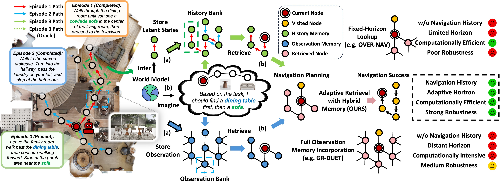

# Memoir: Dream to Recall

<div align="center">

<p align="center" width="100%">

</p>

[](http://arxiv.org/abs/2510.08553)
[](LICENSE)

**Imagination-Guided Experience Retrieval for Memory-Persistent Vision-and-Language Navigation**

</div>

---

## 🔥 News

* Code and pretrained models will be released.

---

## 📖 Table of Contents

* [👋 Overview](#-overview)
* [📊 Performance](#-performance)
---

## 👋 Overview

> Vision-and-Language Navigation (VLN) requires agents to follow natural language instructions through environments. While existing memory-persistent VLN approaches have made progress, they face two critical limitations: **ineffective memory access** through complete incorporation or fixed-horizon lookup, and **neglecting behavioral histories** that encode valuable decision-making patterns. 
>
> We introduce **Memoir** (Model-based Hybrid Viewpoint-Level Memory for Experience Retrieval), which employs **imagination as a retrieval mechanism grounded by explicit memory**. A language-conditioned world model imagines future navigation states as queries to selectively retrieve relevant environmental observations and behavioral histories. This enables adaptive filtering of both environmental and behavioral experiences based on navigation intent.
>
> Experimental results demonstrate Memoir's superiority across diverse memory-persistent VLN benchmarks with 10 distinctive testing scenarios, achieving **5.4% SPL improvement on IR2R** over the best memory-persistent baseline, accompanied by **8.3× training speedup** and **74% inference memory reduction**. Oracle analysis reveals substantial headroom (73.3% vs 93.4% upper bound) for this imagination-guided paradigm, illuminating promising directions for advancing memory-persistent navigation.

---

## 📊 Performance

Memoir achieves state-of-the-art results on both Iterative Room-to-Room (IR2R) and General Scene Adaptation (GSA-R2R) benchmarks, demonstrating consistent improvements across diverse scenarios.

### Iterative Room-to-Room (IR2R)

| Method | Val Seen |          | Val Unseen | |
|--------|:--------:|:--------:|:--------:|:--------:|
| | **SR↑**  | **SPL↑** | **SR↑** | **SPL↑** |
| HAMT |    63    |    61    | 56 | 54 |
| TourHAMT |    45    |    43    | 39 | 36 |
| OVER-NAV |    65    |    63    | 60 | 57 |
| DUET |    80    |    75    | 69 | 58 |
| ScaleVLN |    80    |    74    | 76 | 67 |
| GR-DUET |    61    |    55    | 73 | 68 |
| **Memoir (Ours)** |    72    |    67    | **78** | **73** |

### General Scene Adaptation (GSA-R2R) - User Instructions

| Method | Child | | Keith | | Moira | | Rachel | | Sheldon | |
|--------|:-----:|:-----:|:-----:|:-----:|:-----:|:-----:|:-----:|:-----:|:-----:|:-----:|
| | **SR↑** | **SPL↑** | **SR↑** | **SPL↑** | **SR↑** | **SPL↑** | **SR↑** | **SPL↑** | **SR↑** | **SPL↑** |
| TourHAMT | 14.6 | 12.0 | 15.1 | 12.3 | 13.9 | 11.3 | 15.3 | 12.5 | 14.4 | 11.8 |
| OVER-NAV | 20.9 | 16.1 | 20.5 | 16.4 | 19.5 | 15.4 | 20.6 | 16.2 | 20.5 | 16.2 |
| GR-DUET | 64.9 | 60.5 | 65.1 | 61.4 | 60.5 | 56.6 | 65.7 | 61.7 | 63.0 | 59.0 |
| **Memoir (Ours)** | **66.5** | **61.3** | **68.0** | **63.6** | **62.5** | **57.5** | **68.2** | **63.6** | **65.3** | **60.4** |

### GSA-R2R - Scene Instructions

| Method | **TL↓** | **NE↓** | **SR↑** | **SPL↑** | **nDTW↑** |
|--------|:-------:|:-------:|:-------:|:--------:|:---------:|
| TourHAMT | 7.3 | 8.1 | 9.7 | 8.0 | 32.3 |
| OVER-NAV | 11.8 | 7.6 | 16.7 | 12.6 | 34.6 |
| GR-DUET | 9.9 | 5.5 | 47.1 | 42.2 | 54.1 |
| **Memoir (Ours)** | **10.3** | **5.1** | **50.2** | **44.8** | **56.2** |

### Computational Efficiency

| Method | Training | | Inference | |
|--------|:--------:|:--------:|:---------:|:--------:|
| | **Memory** | **Latency** | **Memory** | **Latency** |
| DUET | 7.2 GB | 0.15s | 2.2 GB | 0.13s |
| GR-DUET | 29.4 GB | 4.39s | 9.9 GB | 0.25s |
| **Memoir (Ours)** | **13.1 GB (-55%)** | **0.53s (-88%)** | **2.6 GB (-74%)** | **0.31s (+28%)** |

> Memoir achieves substantial efficiency gains: 8.3× training speedup and 74% inference memory reduction compared to GR-DUET, while maintaining superior navigation performance.

---

## Citation

If you find our research useful, please cite our paper:

```bibtex
@article{xu2025dream,
  title={Dream to Recall: Imagination-Guided Experience Retrieval for Memory-Persistent Vision-and-Language Navigation},
  author={Xu, Yunzhe and Pan, Yiyuan and Liu, Zhe},
  journal={arXiv preprint arXiv:2510.08553},
  year={2025}
}
```
