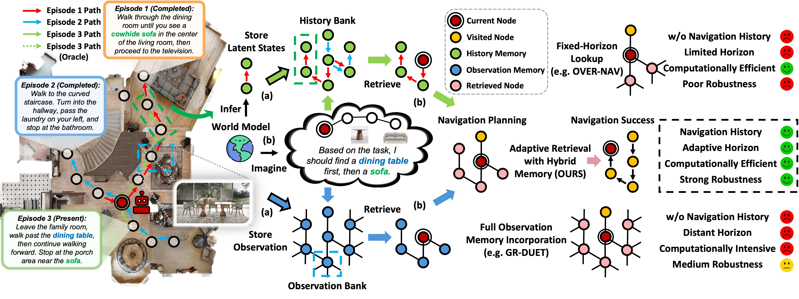

<div align="center">

# Memoir: Dream to Recall



### Imagination-Guided Experience Retrieval for Memory-Persistent Vision-and-Language Navigation

[](https://xyz9911.github.io/memoir/)
[](https://arxiv.org/abs/2510.08553)
[](https://huggingface.co/datasets/xyz9911/Memoir/tree/main)
[](LICENSE)
</div>

## 🔥 News

- **[2026-03-15]** Memoir was accepted by IEEE Transactions on Pattern Analysis and Machine Intelligence (T-PAMI).
- Code is now available. Datasets, image features, and pretrained checkpoints are hosted on [Hugging Face](https://huggingface.co/datasets/xyz9911/Memoir/tree/main).
- We host a [project webpage](https://xyz9911.github.io/memoir/).

## 📖 Contents

- [Overview](#-overview)
- [Installation](#-installation)
- [Data and Checkpoints](#-data-and-checkpoints)
- [Training](#-training)
- [Evaluation](#-evaluation)
- [Performance](#-performance)
- [Citation](#-citation)

## 👋 Overview

Vision-and-Language Navigation (VLN) requires an agent to follow natural-language instructions through an environment. Existing memory-persistent VLN methods often access memory either by incorporating it in full or by looking back over a fixed horizon. They also underuse behavioral history, even though previous decisions provide valuable experience for future navigation.

**Memoir** (Model-based Hybrid Viewpoint-Level Memory for Experience Retrieval) uses imagination as a retrieval mechanism grounded in explicit memory. Its language-conditioned world model imagines future navigation states, then uses those states as queries to selectively retrieve relevant environmental observations and behavioral histories.

Across ten testing scenarios from Iterative Room-to-Room (IR2R) and General Scene Adaptation (GSA-R2R), Memoir improves IR2R SPL by **5.4%** over the strongest memory-persistent baseline while providing an **8.3× training speedup** and **74% lower inference memory usage**. Oracle analysis also shows substantial remaining headroom: 73.3% SPL versus a 93.4% upper bound.

## 🛠️ Installation

Clone the repository and create a dedicated environment:

```bash
git clone git@github.com:xyz9911/Memoir.git
cd Memoir

conda create -n memoir python=3.9 -y
conda activate memoir
```

Follow [DUET](https://github.com/cshizhe/VLN-DUET/tree/main) to prepare the environment and install the [Matterport3DSimulator](https://github.com/peteanderson80/Matterport3DSimulator) so that `import MatterSim` works in the `memoir` environment.

## 📦 Data and Checkpoints

Download the data bundle from [Hugging Face](https://huggingface.co/datasets/xyz9911/Memoir/tree/main) into the repository's `datasets` directory:

```bash
pip install -U huggingface_hub
hf download xyz9911/Memoir --type dataset --local-dir datasets
```

The annotations, image features, connectivity graphs, initialization weights, and Memoir checkpoints should then follow this layout:

```text
datasets/R2R/
├── annotations/
│   ├── ESA_Dataset/
│   ├── R2R_train_enc.json
│   ├── R2R_val_seen_enc.json
│   └── R2R_val_unseen_enc.json
├── connectivity/                 # IR2R
├── connectivity_full/            # GSA-R2R
├── features/
│   └── clip_vit-b16_mp3d_hm3d_gibson.hdf5
├── pretrained/
│   └── grduet_tssm_dropout.pt
├── outputs/
│   ├── ir2r_result/ckpts/best_val_unseen
│   └── gsa_result/ckpts/iter_40000_Validation_Residential_Basic_sr_68.5111111111111_spl_63.39389623658658
├── tours_iVLN.json
└── tours_iVLN_prevalent.json
```

## 🚂 Training

All commands below should be run from the repository root. They use the released `datasets/R2R/pretrained/grduet_tssm_dropout.pt` initialization checkpoint.

### Joint pretraining of the world model and navigation model (Optional)

Skip this step when using the released initialization checkpoint. To pretrain the transformer-based RSSM world model and the navigation model from the base checkpoint specified in the configuration, run:

```bash
python pretrain_r2r.py \
    --config pretrain/config/r2r_rssm_pretrain.json
```

The default configuration trains for 6,000 steps and saves checkpoints under `datasets/R2R/pretrain/grduet_tssm_dropout/ckpts/`. We select checkpoints based on their zero-shot navigation performance. A pretrained checkpoint from this directory can be supplied to the navigation training commands through `--bert_ckpt_file`.

### IR2R

```bash
python train_ir2r.py \
    --output_dir datasets/R2R/outputs/ir2r_result \
    --iters 20000 \
    --log_every 500 \
    --batch_size 4 \
    --mastermind \
    --kl_weight 2.0 \
    --kl_overshoot_weight 2.0 \
    --env_memory_filter 0.0 \
    --env_memory_gamma 1.0 \
    --min_beam_size 1 \
    --max_beam_size 2 \
    --env_memory_dropout 0.0 \
    --env_memory_drop_replace \
    --his_memory_threshold 0.6 \
    --his_memory_gamma 0.8 \
    --max_pairs 20 \
    --multimodal_history \
    --redundant_view \
    --teacher_aug \
    --exp_bw \
    --share_graph \
    --teacher_teleport \
    --include_neighbours \
    --fix_pano_embedding \
    --feat_dropout 0.3 \
    --bert_ckpt_file datasets/R2R/pretrained/grduet_tssm_dropout.pt
```

Training logs and checkpoints are saved under `datasets/R2R/outputs/ir2r_result/logs/` and `datasets/R2R/outputs/ir2r_result/ckpts/`, respectively. The best validation-unseen checkpoint is saved as `best_val_unseen`.

### GSA-R2R

```bash
python train_gsa.py \
    --output_dir datasets/R2R/outputs/gsa_result \
    --split val \
    --iters 200000 \
    --log_every 1000 \
    --batch_size 4 \
    --max_traj_multiple 2.0 \
    --mastermind \
    --kl_weight 2.0 \
    --kl_overshoot_weight 2.0 \
    --env_memory_filter 0.5 \
    --env_memory_gamma 1.0 \
    --min_beam_size 1 \
    --max_beam_size 16 \
    --env_memory_dropout 0.0 \
    --env_memory_drop_replace \
    --his_memory_threshold 0.6 \
    --his_memory_gamma 0.7 \
    --max_pairs 50 \
    --multimodal_history \
    --redundant_view \
    --teacher_aug \
    --exp_bw \
    --share_graph \
    --teacher_teleport \
    --include_neighbours \
    --fix_pano_embedding \
    --fix_pano_value \
    --feat_dropout 0.4 \
    --aug prevalent_aug_train \
    --bert_ckpt_file datasets/R2R/pretrained/grduet_tssm_dropout.pt
```

Training logs and checkpoints are saved under `datasets/R2R/outputs/gsa_result/logs/` and `datasets/R2R/outputs/gsa_result/ckpts/`. Validation starts after 15,000 iterations, and the trainer tracks the three best results for each validation category according to SR + SPL.

## 🧪 Evaluation

### IR2R

The following command evaluates the best validation-unseen checkpoint on the IR2R validation splits:

```bash
python train_ir2r.py \
    --output_dir datasets/R2R/outputs/ir2r_result \
    --test \
    --resume_file datasets/R2R/outputs/ir2r_result/ckpts/best_val_unseen \
    --batch_size 4 \
    --mastermind \
    --kl_weight 2.0 \
    --kl_overshoot_weight 2.0 \
    --env_memory_filter 0.0 \
    --env_memory_gamma 1.0 \
    --min_beam_size 1 \
    --max_beam_size 2 \
    --env_memory_dropout 0.0 \
    --env_memory_drop_replace \
    --his_memory_threshold 0.6 \
    --his_memory_gamma 0.8 \
    --max_pairs 20 \
    --multimodal_history \
    --redundant_view \
    --teacher_aug \
    --exp_bw \
    --share_graph \
    --teacher_teleport \
    --include_neighbours \
    --fix_pano_embedding \
    --feat_dropout 0.3 \
    --bert_ckpt_file datasets/R2R/pretrained/grduet_tssm_dropout.pt
```

### GSA-R2R

The following command evaluates the selected checkpoint on all three GSA-R2R test categories: residential basic, non-residential basic, and non-residential scene instructions.

```bash
python train_gsa.py \
    --output_dir datasets/R2R/outputs/gsa_result \
    --split test \
    --test \
    --resume_file datasets/R2R/outputs/gsa_result/ckpts/iter_40000_Validation_Residential_Basic_sr_68.5111111111111_spl_63.39389623658658 \
    --batch_size 4 \
    --max_traj_multiple 2.0 \
    --mastermind \
    --kl_weight 2.0 \
    --kl_overshoot_weight 2.0 \
    --env_memory_filter 0.5 \
    --env_memory_gamma 1.0 \
    --min_beam_size 1 \
    --max_beam_size 16 \
    --env_memory_dropout 0.0 \
    --env_memory_drop_replace \
    --his_memory_threshold 0.6 \
    --his_memory_gamma 0.7 \
    --max_pairs 50 \
    --multimodal_history \
    --redundant_view \
    --teacher_aug \
    --exp_bw \
    --share_graph \
    --teacher_teleport \
    --include_neighbours \
    --fix_pano_embedding \
    --fix_pano_value \
    --feat_dropout 0.4 \
    --aug prevalent_aug_train \
    --bert_ckpt_file datasets/R2R/pretrained/grduet_tssm_dropout.pt
```

## 📊 Performance

### Iterative Room-to-Room (IR2R)

| Method | Val Seen SR↑ | Val Seen SPL↑ | Val Unseen SR↑ | Val Unseen SPL↑ |
|:--|--:|--:|--:|--:|
| HAMT | 63 | 61 | 56 | 54 |
| TourHAMT | 45 | 43 | 39 | 36 |
| OVER-NAV | 65 | 63 | 60 | 57 |
| DUET | 80 | 75 | 69 | 58 |
| ScaleVLN | 80 | 74 | 76 | 67 |
| GR-DUET | 61 | 55 | 73 | 68 |
| **Memoir (Ours)** | 72 | 67 | **78** | **73** |

### GSA-R2R: User Instructions

| Method | Child SR↑ | Child SPL↑ | Keith SR↑ | Keith SPL↑ | Moira SR↑ | Moira SPL↑ | Rachel SR↑ | Rachel SPL↑ | Sheldon SR↑ | Sheldon SPL↑ |
|:--|--:|--:|--:|--:|--:|--:|--:|--:|--:|--:|
| TourHAMT | 14.6 | 12.0 | 15.1 | 12.3 | 13.9 | 11.3 | 15.3 | 12.5 | 14.4 | 11.8 |
| OVER-NAV | 20.9 | 16.1 | 20.5 | 16.4 | 19.5 | 15.4 | 20.6 | 16.2 | 20.5 | 16.2 |
| GR-DUET | 64.9 | 60.5 | 65.1 | 61.4 | 60.5 | 56.6 | 65.7 | 61.7 | 63.0 | 59.0 |
| **Memoir (Ours)** | **66.5** | **61.3** | **68.0** | **63.6** | **62.5** | **57.5** | **68.2** | **63.6** | **65.3** | **60.4** |

### GSA-R2R: Scene Instructions

| Method | TL↓ | NE↓ | SR↑ | SPL↑ | nDTW↑ |
|:--|--:|--:|--:|--:|--:|
| TourHAMT | **7.3** | 8.1 | 9.7 | 8.0 | 32.3 |
| OVER-NAV | 11.8 | 7.6 | 16.7 | 12.6 | 34.6 |
| GR-DUET | 9.9 | 5.5 | 47.1 | 42.2 | 54.1 |
| **Memoir (Ours)** | 10.3 | **5.1** | **50.2** | **44.8** | **56.2** |

### Computational Efficiency

| Method | Training Memory | Training Latency | Inference Memory | Inference Latency |
|:--|--:|--:|--:|--:|
| DUET | 7.2 GB | 0.15 s | 2.2 GB | 0.13 s |
| GR-DUET | 29.4 GB | 4.39 s | 9.9 GB | 0.25 s |
| **Memoir (Ours)** | **13.1 GB (-55%)** | **0.53 s (-88%)** | **2.6 GB (-74%)** | 0.31 s (+28%) |

## 📜 License

This project is released under the [Apache License 2.0](LICENSE).

## 📝 Citation

If you find this work useful, please cite:

```bibtex
@article{2026memoir,
  author={Xu, Yunzhe and Pan, Yiyuan and Liu, Zhe},
  journal={IEEE Transactions on Pattern Analysis and Machine Intelligence},
  title={Dream to recall: Imagination-guided experience retrieval for memory-persistent vision-and-language navigation},
  year={2026},
  volume={48},
  number={8},
  pages={9035-9049}
}
```
